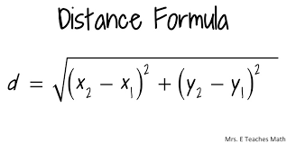
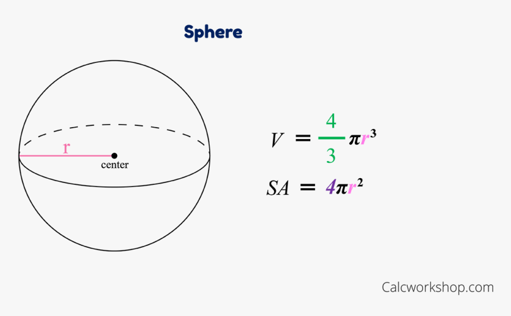
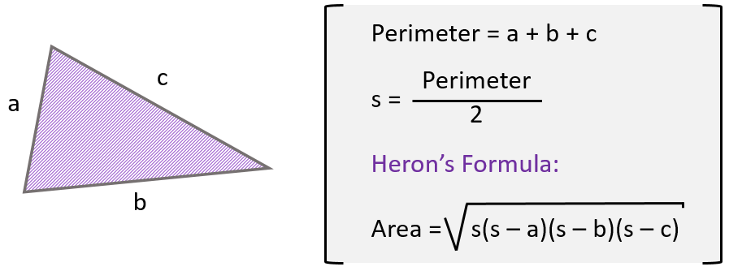

# Lab03 Guide
## Getting Started
[Lab Introduction Video](https://youtu.be/ia9fwrAmMHs)  

- Please clone the [Mod03 Code Examples](https://github.com/lhindman/cs121-mod03-examples.git).  
- Please watch the [Coding Style Review and Activity 1 Walkthough Video](https://www.youtube.com/playlist?list=PLbxWwkW_BhyBf4nsQTeIDirE8c33MhGtX).  


### Code Style Requirements
Please review the [CS121 Style Guide](https://docs.google.com/document/d/1LWbGQBKkApnNAzzgwOSvRM03DmhYWx5yEfecT2WXfjI/edit?usp=sharing) and apply it in all lab activities and projects this semester. Coding Style will assessed as part of your lab and project grades.

### Code Quality Requirements
- Code must compile without warnings using openjdk11
- Code must run without errors or warnings on safe-path and edge test cases
- More to come as we learn about input validation and exception handling
## Activity 1 - AccountGenerator
### Problem Description
Write an application that prompts for and reads the user's first name and last name (separately). Then print a string composed of the first letterof the user's first name, followed by the first five characters of the user's last name, followed by a random number in the range of 10 to 99. All letters should be converted to lowercase before being displayed. Assume that the lastname is at least five letters long.  Similar algorithms are sometimes used to generate usernames for new computer accounts.  

#### Sample Output
```
Enter your first name: Luke
Enter your last name: Hindman
Username: lhindm83
```

### Implementation Guide
1. Expand the folder named A1-AccountGenerator and create a new file named AccountGenerator.java
2. Design a program to satisfy the requirements in the Problem Description and enter the program code in AccountGenerator.java
3. Test the program using the run link above the main method
4. Commit the changes to your local repository with a message stating that Activity 1 is completed.
5. Push the changes from your local repository to the github classroom repository.

## Activity 2 - PhoneNumbers
### Problem Description
Write an application that creates and prints a random phone number of the form XXX-XXX-XXXX. Include the dashes in the output.  Do not let the first three digits contain an 8 or 9 (but don't be more restrictive than that), and make sure that the second set of three digits is not greater than 742.  

*Hint: Think through the easiest way to construct the phone number. Each digit does not have to be determined separately.*  

#### Sample Output
```
A random phone number: 254-460-7860
```

### Implementation Guide
1. Expand the folder named A2-PhoneNumbers and create a new file named PhoneNumbers.java
2. Design a program to satisfy the requirements in the Problem Description and enter the program code in PhoneNumbers.java
3. Test the program using the run link above the main method. Carefully think about each of the different cases you'll need to test for to verify that the application is functioning properly.
4. Commit the changes to your local repository with a message stating that Activity 2 is completed.
5. Push the changes from your local repository to the github classroom repository.

## Activity 3 - DistanceCalculator
### Problem Description
Write an application that reads the (x,y) coordinates for two points from the user.  Computer the distance between the two points using the following formula:



#### Sample Output
```
Enter the first coordinate values:
10 30
Enter the second coordinate values:
15 70
The distance between (10,30) and (15,70) is 40.311288741492746
```

### Impementation Guide
1. Expand the folder named A3-DistanceCalculator and create a new file named DistanceCalculator.java
2. Design a program to satisfy the requirements in the Problem Description and enter the program code in DistanceCalculator.java
3. Test the program using the run link above the main method
4. Commit the changes to your local repository with a message stating that Activity 3 is completed.
5. Push the changes from your local repository to the github classroom repository.

## Activity 4 - SphereCalculator
### Problem Description
Write an application that reads the radius of a sphere from the user and prints its volume and surface area.  Use the following formulas, in which r represents the sphere's radius.  Print the output to four decimal places.



#### Sample Output
```
Enter the sphere's radius: 150
Volume: 14137166.9412
Surface area: 282743.3388
```

### Impementation Guide
1. Expand the folder named A4-SphereCalculator and create a new file named SphereCalculator.java
2. Design a program to satisfy the requirements in the Problem Description and enter the program code in SphereCalculator.java
3. Test the program using the run link above the main method
4. Commit the changes to your local repository with a message stating that Activity 4 is completed.
5. Push the changes from your local repository to the github classroom repository.


## Activity 5 - TriangleCalculator
### Problem Description
Write an application that reads the lengths of the sides of a triangle from the user. Compute the area of the triangle using Heron's formula (below), in which s represents half of the perimeter of the triangle, and a, b, and c represent the lengths of the three sides. Print the area to three decimal places.



#### Sample Output
```
Enter the length of side 1: 10
Enter the length of side 2: 11
Enter the length of side 3: 12
Area: 51.521
```

### Impementation Guide
1. Expand the folder named A5-TriangleCalculator and create a new file named TriangleCalculator.java
2. Design a program to satisfy the requirements in the Problem Description and enter the program code in TriangleCalculator.java
3. Test the program using the run link above the main method
4. Commit the changes to your local repository with a message stating that Activity 5 is completed.
5. Push the changes from your local repository to the github classroom repository.
